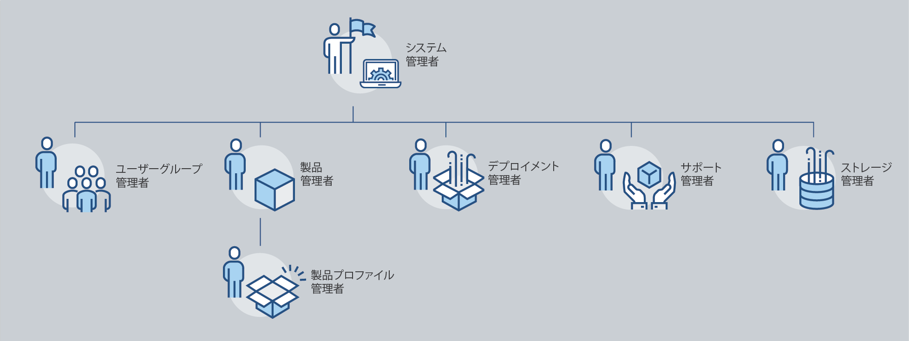
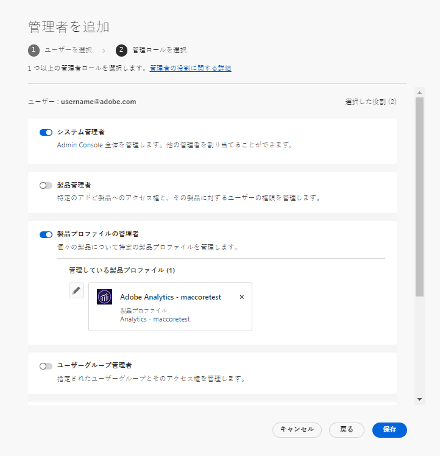
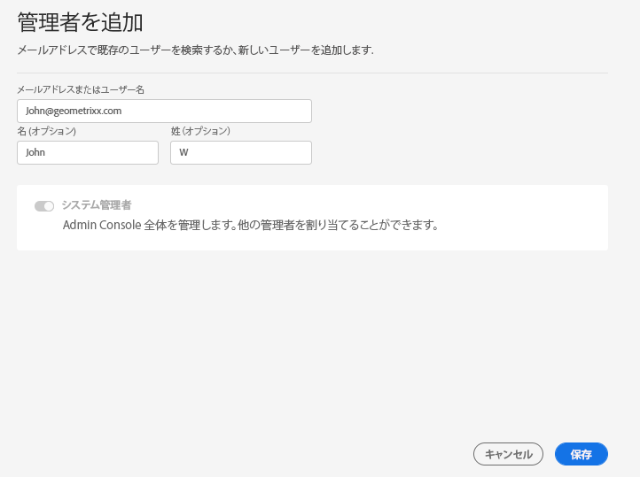
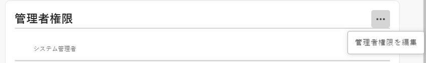
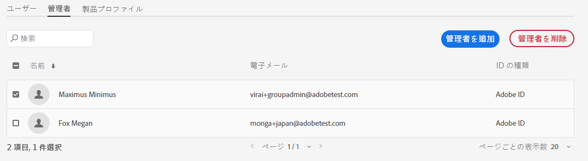

# 管理ロール

Adobe Admin Consoleを使用して、組織は製品のアクセスと使用方法を詳細に管理できる柔軟な管理階層を定義できます。 エンタープライズオンボーディングプロセス中にプロビジョニングされた 1 人以上のシステム管理者が階層の最上部に座ります。 システム管理者は、全体的な制御を維持しながら、他の管理者に責任を委任できます。

管理者ロールは、企業に次のような主なメリットを提供します。

* 行政責任の分散管理
* ユーザー別および製品別の製品割り当てのクイック・ビュー
* 製品管理者に割り当てを割り当てる機能

## 管理階層

適用先：Adobe企業のお客様。

管理階層は、企業固有の要件に合わせて使用できます。 例えば、企業は、Adobe Creative CloudおよびAdobe Marketing Cloud製品の使用権限を管理する様々な管理者を指定できます。 また、企業は、異なるビジネスユニットに属するユーザーの使用権限を管理する管理者を異なる場合もあります。

>[!NOTE]
>
>管理階層は、チームの顧客には適用されません。 チームの顧客は **システム管理者** 役割。 契約所有者 (_以前は&#x200B;**プライマリ管理者**_) は、契約の詳細と請求履歴へのアクセス権を持つシステム管理者です。 現在の契約所有者の場合は、既存のシステム管理者 (_&#x200B;以前は **セカンダリ管理者**_) を契約所有者として追加しました。

_管理者ロール階層_

| 役割 | 説明 |
|--- |--- |
| **システム管理者** | 組織のスーパーユーザーを使用すると、すべての管理タスクをAdmin Consoleで実行できます。 また、には、次の管理機能を他のユーザーに委任する権限があります。製品管理者、製品プロファイル管理者、ユーザーグループ管理者、デプロイメント管理者、サポート管理者。 |
| **製品管理者** | 管理者に割り当てられている製品と、関連するすべての管理機能を管理します。以下が含まれます。<ul><li>製品プロファイルの作成</li><li>ユーザーおよびユーザーグループを組織に追加しますが、削除はしません</li><li>製品プロファイルへのユーザーおよびユーザーグループの追加または削除</li><li>製品プロファイル管理者の製品プロファイルへの追加または削除</li><li>製品の他の管理者を追加または削除する</li><li>グループの管理者の追加または削除</li></ul> |
| **製品プロファイル管理** | 管理者に割り当てられている製品プロファイルの説明と、関連するすべての管理機能を管理します。以下に例を示します。<ul><li>ユーザーおよびユーザーグループを組織に追加しますが、削除はしません</li><li>製品プロファイルへのユーザーおよびユーザーグループの追加または削除</li><li>製品プロファイルからユーザーおよびユーザーグループに対する製品権限を割り当てまたは取り消します</li><li>製品プロファイルに対するユーザーおよびユーザーグループの製品ロールの管理 |
| **ユーザーグループ管理者** | 管理者に割り当てられているユーザーグループの説明と、関連するすべての管理機能を管理します。以下に例を示します。<ul><li>グループに対するユーザーの追加または削除</li><li>ユーザーグループ管理者をグループに追加またはグループから削除する |
| **デプロイメント管理者** | ソフトウェアパッケージおよびエンドユーザーに対する更新を作成、管理、デプロイします。 |
| **サポート管理者** | お客様から報告された問題レポートなど、サポート関連の情報にアクセスできる非管理者ロール。 |
| **ストレージ管理者** | 組織のストレージ管理を管理します。 管理者は、アクティブなユーザーと非アクティブなユーザーの両方のストレージ消費量を表示し、コンテンツを他の受信者に転送できます。 |

各管理者ロールの権限と権限の詳細なリストについては、 [権限](#enterprise-admins-permissions-matrix).

## エンタープライズ管理者ロールの追加 {#add-enterprise-role}

適用先：Adobe企業のお客様。

管理者は、管理者ロールを他のユーザーに割り当て、自分と同じ権限を付与したり、階層内の管理者ロールの下のロールに対する権限を付与したりできます（説明を参照） [上](#administrative-hierarchy). 例えば、製品管理者は製品管理者権限または製品プロファイル管理者権限をユーザーに付与できますが、デプロイメント管理者権限は付与できません。 Admin Consoleの権限については、 [権限マトリックス](#enterprise-admins-permissions-matrix).

管理者を追加または招待するには：

1. 内 [Admin Console](https://adminconsole.adobe.com/)選択 **ユーザー** > **管理者**.

   または、関連する製品、製品プロファイル、ユーザーグループに移動し、 **管理者** タブをクリックします。

1. クリック **管理者を追加**.
1. 名前または電子メールアドレスを入力します。 有効な電子メールアドレスを指定し、画面に情報を入力することで、既存のユーザーを検索したり、新しいユーザーを追加したりできます。
1. クリック **次へ**. 管理者ロールのリストが表示されます。

>[!NOTE]
>
>* この画面のオプションは、アカウントと管理者の役割によって異なります。 同じ特権を与えることも、階層内で自分の下の役割に対する特権を与えることもできます。
>* チームのシステム管理者は、次の 1 つの管理者ロールのみを割り当てることができます。システム管理者。

1. 1 つ以上の管理者ロールを選択します。
1. 「管理者」タイプ（「製品管理者」、「製品プロファイル管理者」、「ユーザーグループ管理者」など）で、特定の製品、プロファイル、グループをそれぞれ選択します。

>[!NOTE]
>
>製品プロファイル管理者は、複数の製品のプロファイルを含めることができます。

1. ユーザーに割り当てられている管理者ロールを確認し、「 **保存**.

新しい管理権限に関する招待メールをユーザーが受け取る `message@adobe.com`.

ユーザーはクリックする必要がある **はじめに** 組織に参加する電子メールを入力します。 新しい管理者が **はじめに** 電子メールの招待状のリンクが含まれている場合、Admin Consoleにサインインできません。

ログインプロセスの一環として、ユーザープロファイルがまだない場合は、Adobeプロファイルを設定するように求められる場合があります。 ユーザーがメールアドレスに複数のプロファイルを関連付けている場合、ユーザーは「チームに参加」（要求された場合）を選択し、新しい組織に関連付けられたプロファイルを選択する必要があります。

## チーム管理者の追加 {#add-admin-teams}

適用先：Adobeチームの顧客。

管理者は、システム管理者の役割を他のユーザーに割り当て、自分と同じ権限を与えることができます。

システム管理者を追加または招待するには：

1. Admin Consoleで、「 」を選択します。 **ユーザー** > **管理者**.

   既存の管理者のリストが表示されます。

1. クリック **管理者を追加**.

   この **管理者の追加** 画面が表示されます。

1. 名前または電子メールアドレスを入力します。 有効な電子メールアドレスを指定し、画面に情報を入力することで、既存のユーザーを検索したり、新しいユーザーを追加したりできます。

   デフォルトでは、「システム管理者」が選択されています。

1. クリック **保存**.

チーム組織内のすべてのユーザーは Business ID ユーザーなので、新しい管理権限に関する招待メールをから受け取ります。 `message@adobe.com`.
ユーザーが組織に参加するには、電子メールの「はじめに」をクリックする必要があります。

ログインプロセスの一環として、ユーザープロファイルがまだない場合は、Adobeプロファイルを設定するように求められる場合があります。 ユーザーがメールアドレスに複数のプロファイルを関連付けている場合、ユーザーは「チームに参加」（要求された場合）を選択し、新しい組織に関連付けられたプロファイルを選択する必要があります。

## エンタープライズ管理者ロールを編集

適用先：Adobe企業のお客様。

管理者は、管理階層内で自分より下にある他の管理者に対して、管理者の役割を編集できます。 例えば、他の管理者の管理者権限を削除できます。

管理者ロールを編集するには：

1. Admin Consoleで、「 」を選択します。 **ユーザー** > **管理者**. 既存の管理者のリストが表示されます。

   または、関連する製品、製品プロファイル、ユーザーグループに移動し、 **管理者** タブをクリックします。

1. 編集する管理者の名前をクリックします。
1. 内 **ユーザーの詳細**&#x200B;をクリックし、  の **管理権限** 「 」セクションで「 」を選択します。 **管理者権限の編集**.

   

1. 管理権限を編集し、変更を保存します。

## チーム管理者ロールの編集

適用先：Adobeチームの顧客。

チームのシステム管理者は、他の管理者のシステム管理者権限を削除できます。

システム管理者権限を失効するには、次の手順に従います。

1. Admin Consoleで、「 」を選択します。 **ユーザー** > **管理者**.

   既存の管理者のリストが表示されます。

1. ユーザーの詳細で、  右 **管理権限** 「 」セクションで「 」を選択します。 **管理者権限の編集**.

   

1. 管理権限を編集し、変更を保存します。

## 管理者の削除

適用先：Adobeチームの企業のお客様。

1. 管理者権限を失効するには、ユーザーを選択し、 **管理者を削除**.

>[!NOTE]
>
>管理者を削除しても、Admin Consoleからはユーザーが削除されず、管理者の役割に関連付けられた権限のみが削除されます。

## Enterprise 管理者権限マトリックス

適用先：Adobe企業のお客様。

次の表に、様々な種類の管理者に対するすべての権限を、次の機能の領域別に分類して示します。

### ID 管理

| 権限 | システム管理者 | サポート管理者 |
|--- |--- |--- |
| ドメインを追加（ドメインをリクエスト/クレーム） | ✔ |  |
| ドメインとドメインの一覧を表示 | ✔ |  |
| ドメイン暗号化キーの管理 | ✔ |  |
| デフォルトの組織のパスワードポリシーを管理 | ✔ |  |
| デフォルトの組織のパスワードポリシーを表示 | ✔ |  |

### ユーザー管理

| 権限 | システム管理者 | サポート管理者 |
|--- |--- |--- |
| 組織にユーザーを追加 | ✔ |  |
| 組織からユーザーを削除 | ✔ |  |
| ユーザーの詳細と一覧の表示 | ✔ |  |
| ユーザープロファイルを編集 | ✔ |  |
| 製品プロファイルをユーザーまたはグループに追加 | ✔ |  |
| 製品プロファイルをユーザーまたはグループに削除 | ✔ |  |
| 複数のユーザーへの製品プロファイルの追加 | ✔ |  |
| ユーザーの製品プロファイルの表示 | ✔ |  |
| 製品ユーザーリストの表示 | ✔ |  |
| 組織へのユーザーの一括追加 | ✔ |  |

### 管理者管理

| 権限 | システム管理者 | サポート管理者 |
|--- |--- |--- |
| ユーザーに組織管理者を付与する | ✔ |  |
| ユーザーから組織管理を取り消す | ✔ |  |
| ユーザーに製品ライセンス管理者を付与する | ✔ |  |
| ユーザーから製品ライセンス管理を取り消す | ✔ |  |
| ユーザーにデプロイメント管理者を付与する | ✔ |  |
| ユーザーからのデプロイメント管理者の取り消し | ✔ |  |
| ユーザーにユーザーグループ管理者を付与する | ✔ |  |
| ユーザーからのユーザーグループ管理を取り消す | ✔ |  |
| ユーザーに製品所有者の管理者を付与する | ✔ |  |
| ユーザーから製品所有者管理を取り消す | ✔ |  |

### 製品ライセンス設定管理

| 権限 | システム管理者 | サポート管理者 |
|--- |--- |--- |
| 組織に対する製品の使用権限の付与 |  |  |
| 組織から製品の使用権限を削除 |  |  |
| 組織が所有するライセンスの合計数を表示 | ✔ |  |
| 使用可能な製品と製品ファミリを表示 | ✔ |  |
| 製品ライセンスの説明/データの編集 | ✔ |  |
| ユーザーに対する製品ライセンスのプロビジョニング | ✔ |  |
| ユーザーから製品ライセンスのプロビジョニングを解除 | ✔ |  |
| 新しい製品ライセンス設定を追加 | ✔ |  |
| 製品ライセンスサービス設定を編集 | ✔ |  |
| 製品ライセンスサービス設定を削除 | ✔ |  |
| ユーザーから製品へのアクセスを削除（すべての設定から削除） | ✔ |  |

### ストレージ管理

| 権限 | システム管理者 | サポート管理者 |
|--- |--- |--- |
| アクティブなユーザーフォルダと非アクティブなユーザーフォルダの表示 | ✔ |  |
| 非アクティブなユーザーフォルダーの削除とコンテンツの転送 | ✔ |  |

### 導入

| 権限 | システム管理者 | サポート管理者 |
|--- |--- |--- |
| 「パッケージ」タブを表示/使用 | ✔ |  |

### サポート

| 権限 | システム管理者 | サポート管理者 |
|--- |--- |--- |
| 「サポート」タブを表示 | ✔ |  |
| サポートケースの管理 | ✔ | ✔ |

### ユーザーグループ管理

| 権限 | システム管理者 | サポート管理者 |
|--- |--- |--- |
| ユーザーグループを作成 | ✔ |  |
| ユーザーグループを削除 | ✔ |  |
| ユーザーグループにユーザーを追加 | ✔ |  |
| ユーザーグループからユーザーを削除 | ✔ |  |
| 製品ライセンスにユーザーグループを割り当て | ✔ |  |
| 製品ライセンスからユーザーグループを削除 | ✔ |  |
| ユーザーグループのメンバーを表示 | ✔ | ✔ |
| ユーザーグループのリストを表示 | ✔ | ✔ |
