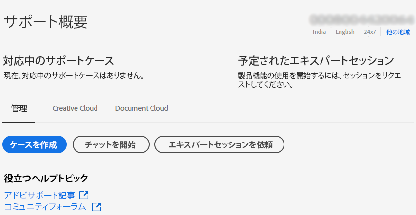

# エンタープライズ版とチーム版 |お問い合わせAdobeカスタマーケア

Adobeカスタマーケアに問い合わせるには、 **サポート** 」タブをクリックします。 [Admin Console](https://adminconsole.adobe.com/).

この **「サポート」タブ** 内 [Admin Console](https://adminconsole.adobe.com/) では、使いやすいシンプルなインターフェイスを使用して、様々なサポートオプションにアクセスできます。 「サポート」タブで使用できるオプションは、サブスクリプションプランによって異なります。 詳しくは、 **詳細情報** サブスクリプションプランに対応している。

サブスクリプションプランが不明な場合は、 **「サポート」タブ** の [Admin Console](https://adminconsole.adobe.com/)をクリックし、表示を以下の画像と比較します。 次に、 **詳細情報** リンク。

## チームアカウント

[詳細情報](https://helpx.adobe.com/enterprise/using/support-for-teams.html)

## エンタープライズアカウントの場合

[詳細情報](https://helpx.adobe.com/enterprise/using/support-for-enterprise.html)

## Experience Cloud

[詳細情報](https://www.adobe.com/go/ac_ec_not_supported_en)
