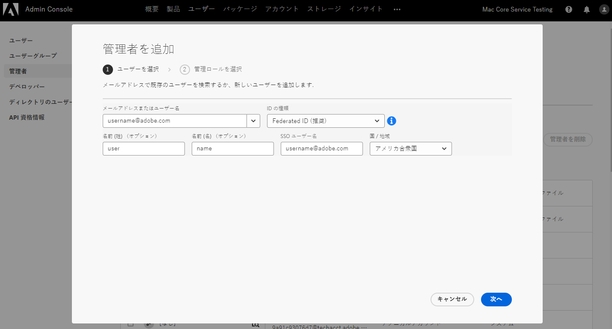
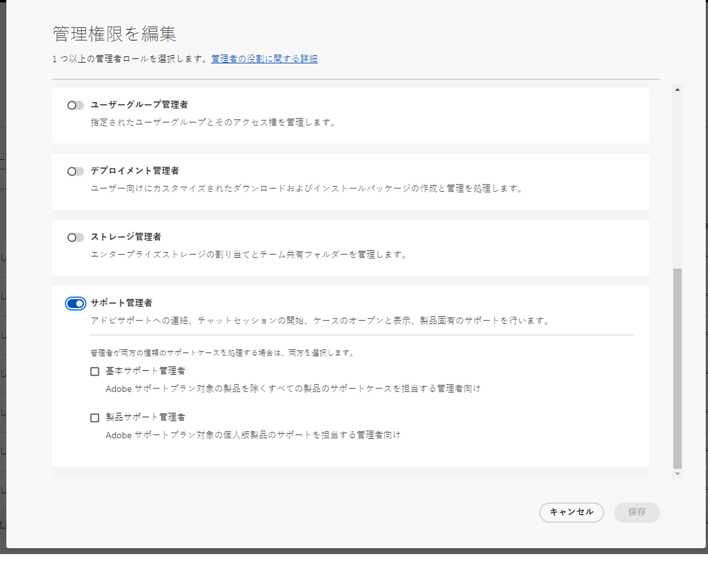
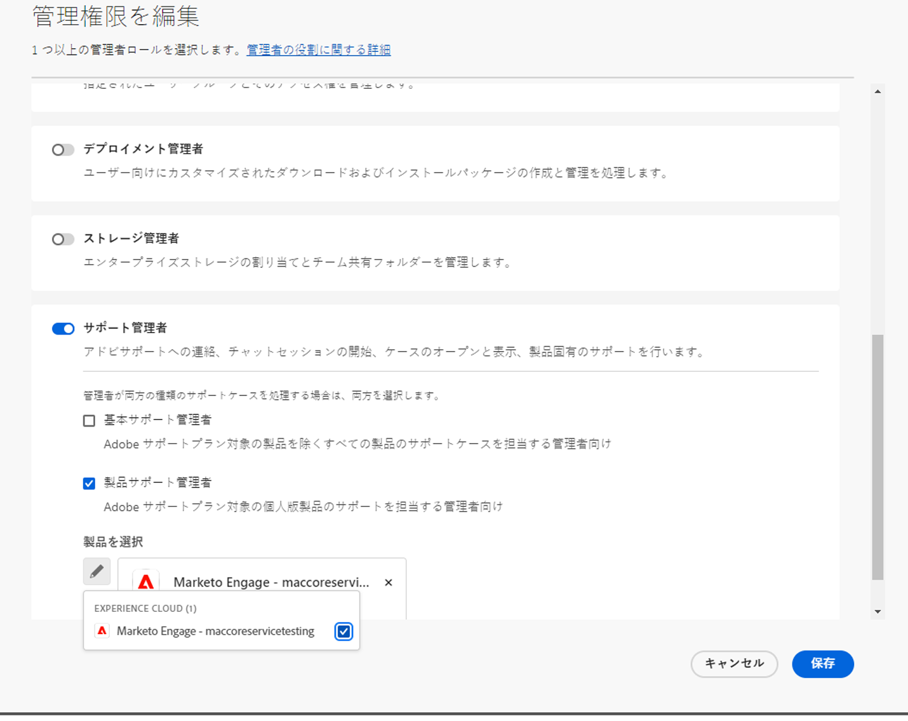
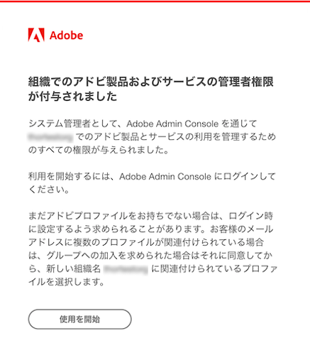
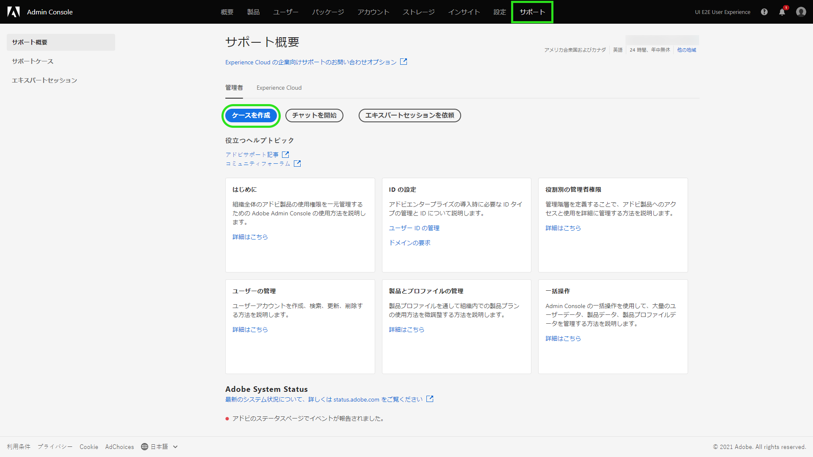
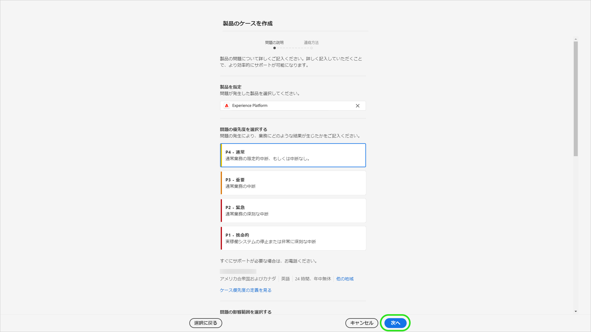
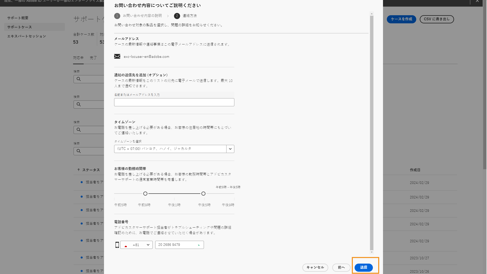

# アドビカスタマーサポートの機能

## Admin Console サポートチケット

サポートチケットを [Admin Console](https://adminconsole.adobe.com/) から送信できるようになりましたので、ご利用ください。サポートチケットの送信方法については、[サポートチケットの送信](#submit-ticket)をご覧ください。

アドビは、お客様がアドビカスタマーサポートとやり取りする方法の向上に取り組んでいます。その一環として、一元的なエントリポイントである Adobe Admin Console に移行し、サポートエクスペリエンスを合理化することとなりました。新ポータルへの移行が完了次第、アドビカスタマーサポートに簡単にアクセスできるようになります。製品をまたいで共通のシステムを利用することで、サービス履歴の明確な把握がより容易になり、電話、web、チャットによるヘルプリクエストもこの単一のポータルから可能になって利便性が高まります。

## Admin Console サポートチケットの送信方法 {#submit-ticket}

サポートチケットを [Admin Console](https://adminconsole.adobe.com/) に送信するには、システム管理者から割り当てられたサポート管理者の役割が必要です。この役割を割り当てることができるのは、組織内のシステム管理者だけです。製品、製品プロファイル、その他の管理者の役割では、サポート管理者の役割を割り当てられず、サポートチケットを送信するために使用するオプションである&#x200B;**[!UICONTROL ケースを作成]**&#x200B;を閲覧することができません。詳しくは、[エンタープライズおよびチーム向けカスタマーケア](customer-care.md)ドキュメントをご参照ください。

### サポート管理者の役割を割り当てる

サポート管理者の役割は、サポート関連の情報にアクセスできる非管理者の役割です。サポート管理者は、問題レポートを表示、作成、管理することができます。

管理者を追加または招待するには、

1. Admin Consoleで、**[!UICONTROL ユーザー]**／**[!UICONTROL 管理者]**&#x200B;を選択します。
1. **[!UICONTROL 管理者を追加]**&#x200B;をクリックします。
1. 名前または電子メールアドレスを入力します。

   既存のユーザーを検索するか、有効な電子メールアドレスを指定して画面に情報を入力することで、新しいユーザーを追加できます。

   

1. **[!UICONTROL 次へ]**&#x200B;をクリックします。管理者の役割リストが表示されます。

サポート管理者の役割をユーザーに割り当てる（ユーザーがサポートに連絡できるようにする）には、次の手順を実行します。

1. を選択します。 **[!UICONTROL サポート管理者]** オプション。

   

1. 次の 2 つのオプションのいずれかを選択します。

   * オプション 1: **[!UICONTROL 基本的なサポート管理者]**. すべてのソリューション (Marketoを除く ) に対するユーザーサポートを提供する場合は、このオプションを選択します。
   * オプション 2: **[!UICONTROL 製品サポート管理者]**:Marketoのサポートにこのオプションを選択します。 ユーザーサポートへのアクセスを許可するMarketoインスタンスを選択します。

   

1. 選択が完了したら、 **[!UICONTROL 保存]**.

ユーザーは `message@adobe.com` から、新しい管理権限に関する招待メールを受け取ります。

ユーザーが組織に参加するには、電子メールにある **開始する**&#x200B;をクリックする必要があります。新しい管理者が、招待メールの **開始する**&#x200B;のリンクを使用しない場合、Admin Console にサインインできません。

ログインプロセスの一環として、ユーザープロファイルがまだない場合は、Adobe プロファイルを設定するように求められる場合があります。ユーザーが E メールアドレスに複数のプロファイルを関連付けている場合、ユーザーは **チームに参加** （プロンプトが表示された場合）を選択し、新しい組織に関連付けられたプロファイルを選択します。

詳しくは、 [enterprise 管理者ロールの編集](admin-roles.md#add-enterprise-role) 管理ロールに関するドキュメントの手順。 この役割を割り当てられるのは、組織のシステム管理者のみであることにご注意ください。管理のヒエラルキーについての詳細は、[管理者役割](admin-roles.md)ドキュメントをご参照ください。

### Admin Console を使用してサポートチケットを作成

[Admin Console](https://adminconsole.adobe.com/) を使用してチケットを作成するには、ナビゲーションのトップにある「**[!UICONTROL サポート]**」タブを選択します。[!UICONTROL サポートの概要]ページが表示されます。次に、「**[!UICONTROL ケースを作成]**」オプションを選択します。

>[!TIP]
>
> 「**[!UICONTROL ケースを作成]**」オプションまたは「**[!UICONTROL サポート]**」タブが表示されない場合は、システム管理者に問い合わせて、サポート管理者の役割を割り当てる必要があります。

問題のタイプを選択するためのダイアログが表示されます。問題または質問に関して最も的確に説明する問題の種類を選択し、右下の「**[!UICONTROL ケースを作成]**」を選択します。

**[!UICONTROL ケースを作成]**&#x200B;ダイアログが表示されます。製品、優先度、説明、問題の説明に役立つスクリーンショットを添付するなど、いくつかの情報を提供するよう求められます。「**[!UICONTROL 次へ]**」を選択して続行します。

>[!NOTE]
>
> 当該の問題が生産システムの停止や極めて深刻な中断につながる場合は、直ちに支援を受けられるよう電話番号が提供されます。

次のページでは、連絡先情報と、アドビカスタマーサポートから連絡を受けるのに最適な時間を入力します。完了したら、右下に表示された「**[!UICONTROL 送信]**」を選択します。チケットがアドビカスタマーサポートに送信されます。

<!--

## What About the Legacy Systems?

New Tickets/Cases will no longer be able to be submitted in legacy systems as of May 11th.  The [Admin Console](https://adminconsole.adobe.com/) will be used to submit new tickets/cases.

### Existing Tickets/Cases

* Between May 11th and May 20th the legacy systems will remain available to work existing tickets/cases to completion.
* Beginning May 20th the support team will migrate remaining open cases from the legacy systems to the new support experience.  You will receive an email notification regarding how to contact support to continue to work these cases.
-->
