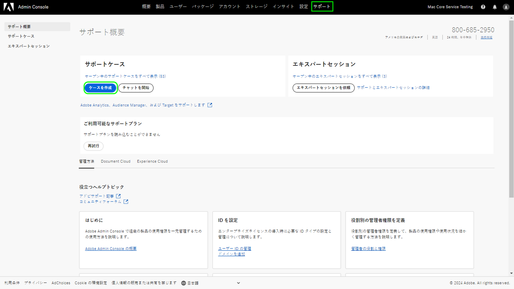
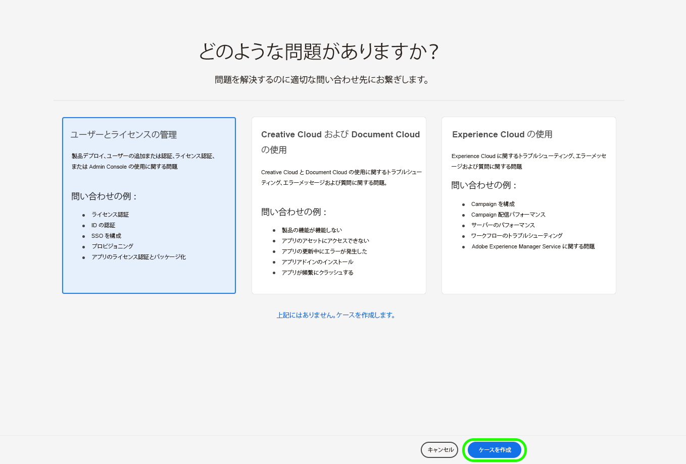

# Adobeカスタマーサポートエクスペリエンス

## Admin Consoleサポートチケット

サポートチケットを [Admin Console](https://adminconsole.adobe.com/). サポートチケットの送信方法については、 [サポートチケットの送信](#submit-ticket).

アドビは、お客様がカスタマーサポートとどのようにやり取りするかをAdobe化に取り組んでいます。 その一環として、Adobe Admin Consoleを使用した単一のエントリーポイントに移行し、サポートを合理化することになりました。 運用が開始されると、組織は簡単にAdobeカスタマーサポートにアクセスできます。製品間で共通のシステムを使用して、サービス履歴をより詳細に把握できます。電話、Web、単一のポータル経由でのチャットを通じてヘルプをリクエストできます。

## 新しいサポートプラットフォームに関するヘルプが必要な場合は、

お客様が新しいサポートプロセスに関して質問を投げかける一連のオンラインミーティングを提供しています。 結合する 1 つ以上の項目を選択：

| 日時 | 登録リンク |
|--- |--- |
| 木曜日、4 月 7 日午前 8 時（太平洋標準時） | [イベントリンク](https://event.on24.com/wcc/r/3723732/5288A3B031AD858BF241EB0C0057CD85) |
| 木曜日、4 月 7 日午後 5 時 (PT) | [イベントリンク](https://event.on24.com/wcc/r/3723733/286EFEA9E8D9B6BB49464862F5414B8C) |
| 4 月 20 日（水）午前 8 時（太平洋標準時） | [イベントリンク](https://event.on24.com/wcc/r/3712143/05DAF046E4BB864E7C313B056ADE4EB2) |
| 4 月 20 日（水）午後 5 時 (PT) | [イベントリンク](https://event.on24.com/wcc/r/3723740/A9EDA45FA61D3FFC4BF713419B677F16) |
| 4 月 21 日木曜日午前 8 時（太平洋標準時） | [イベントリンク](https://event.on24.com/wcc/r/3723741/C7EBCD38583D4D7AFCBD56029EB17C98) |
| 4 月 21 日木曜日午後 5 時 (PT) | [イベントリンク](https://event.on24.com/wcc/r/3723743/6F41ED2648A621F1419A56F0A52F4446) |

{style=&quot;table-layout:auto&quot;}

## Admin Consoleサポートチケットの送信方法 {#submit-ticket}

サポートチケットを [Admin Console](https://adminconsole.adobe.com/)の場合は、システム管理者から割り当てられたサポート管理者の役割が必要です。 この役割を割り当てることができるのは、組織内のシステム管理者だけです。 製品、製品プロファイル、その他の管理ロールは、サポート管理者ロールを割り当てられず、 **[!UICONTROL ケースを作成]** サポートチケットを送信するために使用するオプション。 詳しくは、 [エンタープライズおよびチーム向けカスタマーケア](customer-care.md) ドキュメント。

### サポート管理者ロールの割り当て

サポート管理者の役割は、サポート関連の情報にアクセスできる非管理者の役割です。 サポート管理者は、問題レポートを表示、作成、管理できます。

サポート管理者の役割を割り当てるには、 [enterprise 管理者ロールの編集](admin-roles.md#add-admin-teams) 管理ロールに関するドキュメントの手順 この役割を割り当てられるのは、組織のシステム管理者のみです。 管理階層について詳しくは、 [管理者ロール](admin-roles.md) ドキュメント。

### Admin Console

を使用してチケットを作成するには [Admin Console](https://adminconsole.adobe.com/)を選択し、 **[!UICONTROL サポート]** 」タブが表示されます。 この [!UICONTROL サポートの概要] ページが表示されます。 次に、 **[!UICONTROL ケースを作成]** オプション。

>[!TIP]
>
> が **[!UICONTROL ケースを作成]** オプションまたは **[!UICONTROL サポート]** 「 」タブで、システム管理者に問い合わせて、サポート管理者の役割を割り当てる必要があります。

問題のタイプを選択するためのダイアログが表示されます。 問題または質問に最も適した問題の種類を選択し、 **[!UICONTROL ケースを作成]** を右下に表示します。

この **[!UICONTROL ケースを作成]** ダイアログが表示されます。 製品、優先度、説明、問題の説明に役立つスクリーンショットを添付するなど、いくつかの情報を提供するよう求められます。 選択 **[!UICONTROL 次へ]** をクリックして続行します。

>[!NOTE]
>
> 問題が発生した場合、または実稼動システムが非常に重大な中断を引き起こした場合は、電話番号がすぐに支援用に提供されます。

次のページでは、連絡先情報を入力し、カスタマーサポートから連絡を受けるのに最適なAdobe時間を提供できます。 完了したら、「 」を選択します。 **[!UICONTROL 送信]** の右下に表示され、チケットがAdobeカスタマーサポートに送信されます。

<!--

## What About the Legacy Systems?

New Tickets/Cases will no longer be able to be submitted in legacy systems as of May 11th.  The [Admin Console](https://adminconsole.adobe.com/) will be used to submit new tickets/cases.

### Existing Tickets/Cases

* Between May 11th and May 20th the legacy systems will remain available to work existing tickets/cases to completion.
* Beginning May 20th the support team will migrate remaining open cases from the legacy systems to the new support experience.  You will receive an email notification regarding how to contact support to continue to work these cases.
-->
