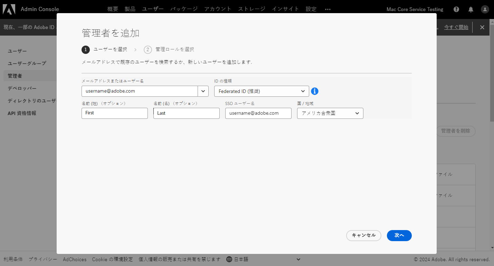
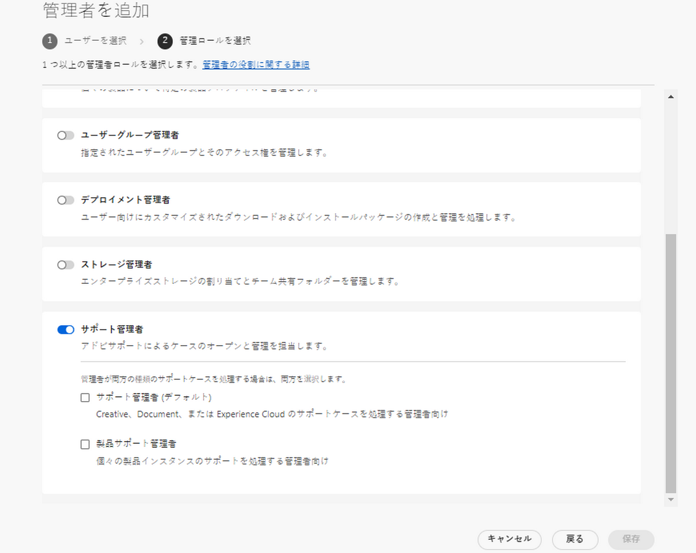
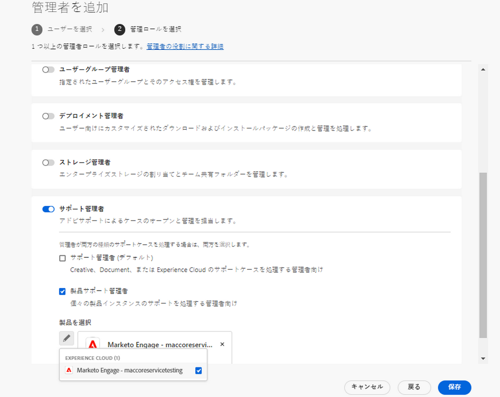

# アドビカスタマーサポートの機能

## Experience League サポートチケット

サポートチケットが [Experience League](https://experienceleague.adobe.com/home?lang=ja#support) 経由で送信できるようになりました。サポートチケットの送信方法については、[サポートチケットの送信](#create-a-support-ticket-with-experience-league)をご覧ください。

アドビは、お客様がアドビカスタマーサポートとやり取りする方法の向上に取り組んでいます。その一環として、一元的なエントリポイントである Experience League に移行し、サポートエクスペリエンスを合理化することとなりました。新ポータルへの移行が完了次第、アドビカスタマーサポートに簡単にアクセスできるようになります。製品をまたいで共通のシステムを利用することで、サービス履歴の明確な把握がより容易になり、電話、web、チャットによるヘルプリクエストもこの単一のポータルから可能になって利便性が高まります。

Adobe Commerce ユーザーの場合は、Adobe Commerce の Experience League サポートユーザーガイドの[サポートケースの送信](https://experienceleague.adobe.com/ja/docs/commerce-knowledge-base/kb/help-center-guide/magento-help-center-user-guide#support-case)を参照してください。

## サポートリクエストの提出に必要な役割 {#submit-ticket}

サポートチケットを [Experience League](https://experienceleague.adobe.com/home?lang=ja#support) に送信するには、システム管理者から割り当てられたサポート管理者の役割が必要です。この役割を割り当てることができるのは、組織内のシステム管理者だけです。製品、製品プロファイル、その他の管理者の役割では、サポート管理者の役割を割り当てられず、サポートチケットを送信するために使用するオプションである&#x200B;**[!UICONTROL ケースを作成]**&#x200B;を閲覧することができません。様々なタイプの管理者の役割とその権限について詳しくは、[管理者の役割](admin-roles.md)を参照してください。

Commerce を使用している場合、サポートケースの操作へのアクセスを共有するプロセスは異なります。詳しくは、Adobe Commerce の Experience League サポートユーザーガイドの[共有アクセス：自分のアカウントにアクセスする権限を他のユーザーに付与する](https://experienceleague.adobe.com/ja/docs/commerce-knowledge-base/kb/help-center-guide/magento-help-center-user-guide#shared-access)を参照してください。

### サポートエンティティの役割を組織に追加

サポート管理者の役割は、サポート関連の情報にアクセスできる非管理者の役割です。サポート管理者は、問題レポートを表示、作成、管理することができます。

管理者を追加または招待するには、

1. Admin Console で、**[!UICONTROL ユーザー]**／**[!UICONTROL 管理者]**&#x200B;を選択します。
1. **[!UICONTROL 管理者を追加]**&#x200B;をクリックします。
1. 名前または電子メールアドレスを入力します。

   有効な電子メールアドレスを指定し、画面に情報を入力することで、既存のユーザーを検索したり、新しいユーザーを追加したりすることができます。

   

1. **[!UICONTROL 次へ]**&#x200B;をクリックします。管理者の役割リストが表示されます。

サポート管理者の役割をユーザーに割り当てる（ユーザーがサポートに連絡できるようにする）には、次の手順を実行します。

1. 「**[!UICONTROL サポート管理者]**」オプションを選択します。

   

1. 次の 2 つのオプションのいずれかを選択します。

   * オプション 1：**[!UICONTROL 基本的なサポート管理者]**。すべてのソリューション（Marketo Engage を除く）に対するユーザーサポートを提供する場合は、このオプションを選択します。
   * オプション 2：**[!UICONTROL 製品サポート管理者]**：Marketo Engage のサポートには、このオプションを選択します。ユーザーサポートへのアクセスを許可する Marketo Engage インスタンスを選択します。

   

1. 選択が完了したら、「**[!UICONTROL 保存]**」をクリックします。

ユーザーは `message@adobe.com` から、新しい管理権限に関する招待メールを受け取ります。

ユーザーが組織に参加するには、電子メールにある「**開始する**」をクリックする必要があります。新しい管理者が、招待メールの「**開始する**」のリンクを使用しない場合、Admin Console にサインインできません。

ログインプロセスの一環として、ユーザープロファイルがまだない場合は、Adobe プロファイルを設定するように求められる場合があります。ユーザーがメールアドレスに複数のプロファイルを関連付けている場合、ユーザーは「**チームに参加**」（要求された場合）を選択し、新しい組織に関連付けられたプロファイルを選択する必要があります。

詳しくは、管理者役割に関するドキュメントの[エンタープライズ管理者役割の編集](admin-roles.md#add-enterprise-role)手順を確認してください。この役割を割り当てられるのは、組織のシステム管理者のみであることにご注意ください。管理のヒエラルキーについての詳細は、[管理者役割](admin-roles.md)ドキュメントをご参照ください。

### Experience League を使用してサポートチケットを作成

サポートケースを送信するプロセスは、Experience League サポートプラットフォームに直接統合されるようになりました。これは、資格のある顧客に対してより多くのパーソナライゼーションと使いやすさを提供するように最近再設計されたセルフサービスポータルです。

1. [Experience League](https://experienceleague.adobe.com/home?lang=ja#support) を使用してチケットを作成するには、ナビゲーションのトップにある「**[!UICONTROL サポート]**」タブを選択します。
   
1. サポートホームページから、開いているサポートケースに簡単に移動したり、新しいケースをログに記録したり、上位のサポート記事を表示したり、追加の学習ソースにアクセスしたりできます。
   
1. ケースを送信するには、「**[!UICONTROL サポートチケットを開く]**」を選択します。または、サイドバーメニューの「**[!UICONTROL チケットを開く]**」オプションを選択します。ケース作成ページに移動します。このページで、製品名（Audience Manager、Campaign、Target など）、ケースのタイトル、ケースの説明を入力できます。トラブルシューティングプロセスを迅速に進めるには、発生している問題を説明する際に、できるだけ詳しく説明してください。
   
1. フォームの最後のほうにある、次のフィールドに入力します。ソリューションを選択すると、次の質問が表示され、一部のソリューションには追加のフィールドがあります。

   * ケースの優先度（低、中、高、重大）
   * ビジネスへの影響
   * お客様のタイムゾーン（米州、EMEA、APAC）

>[!TIP]
>
> 「**[!UICONTROL ケースを作成]**」オプションまたは「**[!UICONTROL サポート]**」タブが表示されない場合は、システム管理者に問い合わせて、サポート管理者の役割を割り当てる必要があります。

>[!NOTE]
>
> 当該の問題が生産システムの停止や深刻な中断につながる場合は、直ちに支援を受けられるよう電話番号が提供されます。

<!--

## What About the Legacy Systems?

New Tickets/Cases will no longer be able to be submitted in legacy systems as of May 11th.  The [Admin Console](https://adminconsole.adobe.com/) will be used to submit new tickets/cases.

### Existing Tickets/Cases

* Between May 11th and May 20th the legacy systems will remain available to work existing tickets/cases to completion.
* Beginning May 20th the support team will migrate remaining open cases from the legacy systems to the new support experience.  You will receive an email notification regarding how to contact support to continue to work these cases.
-->
