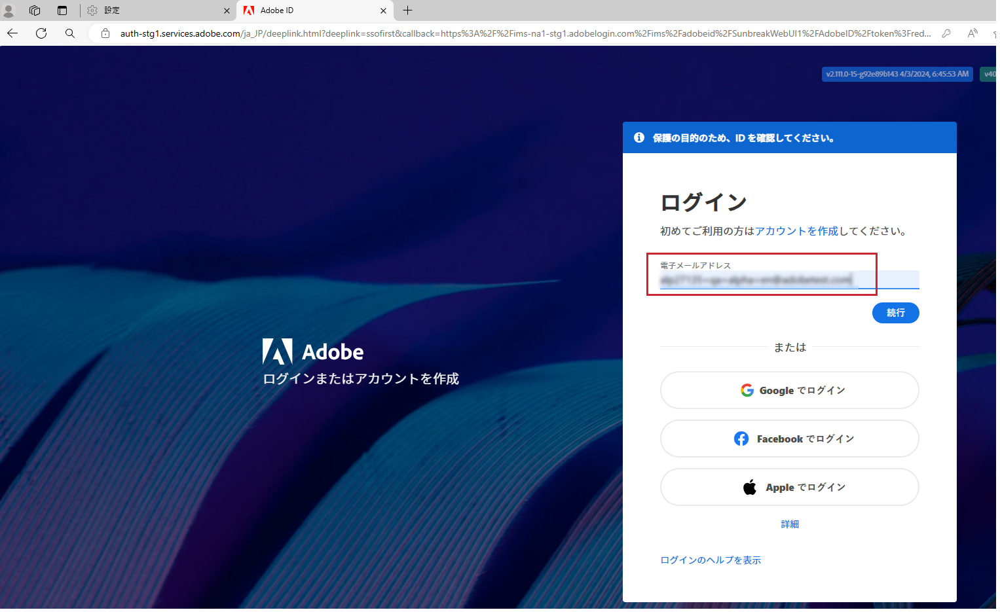
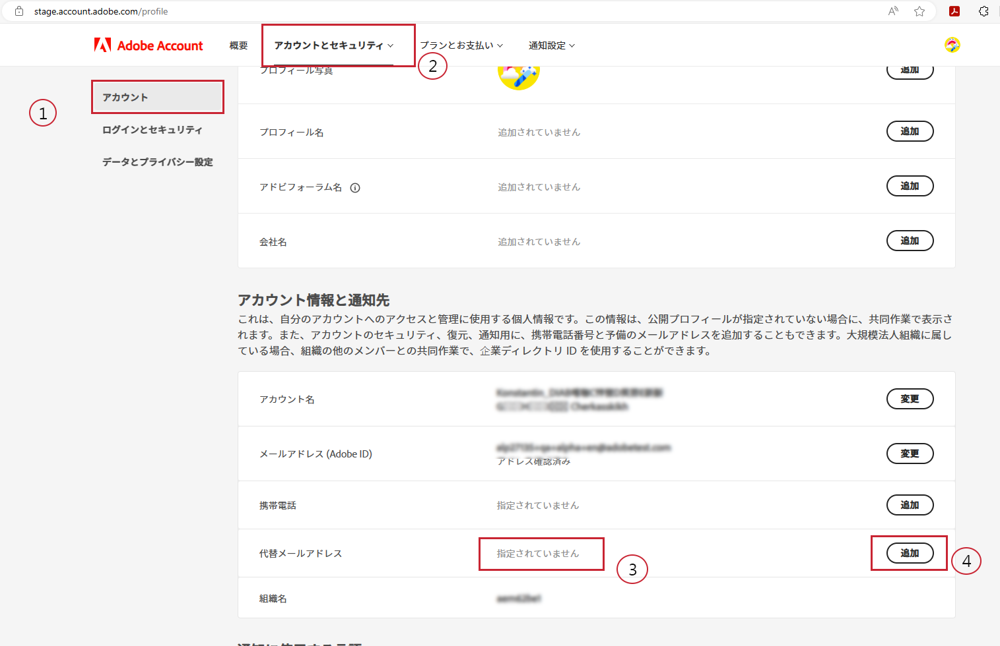
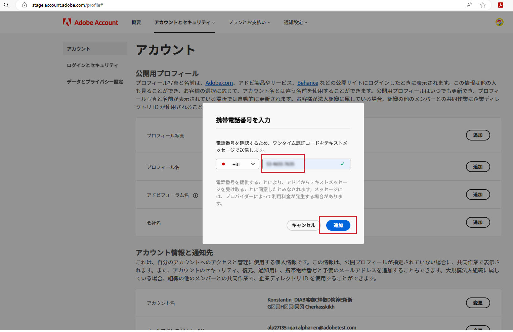
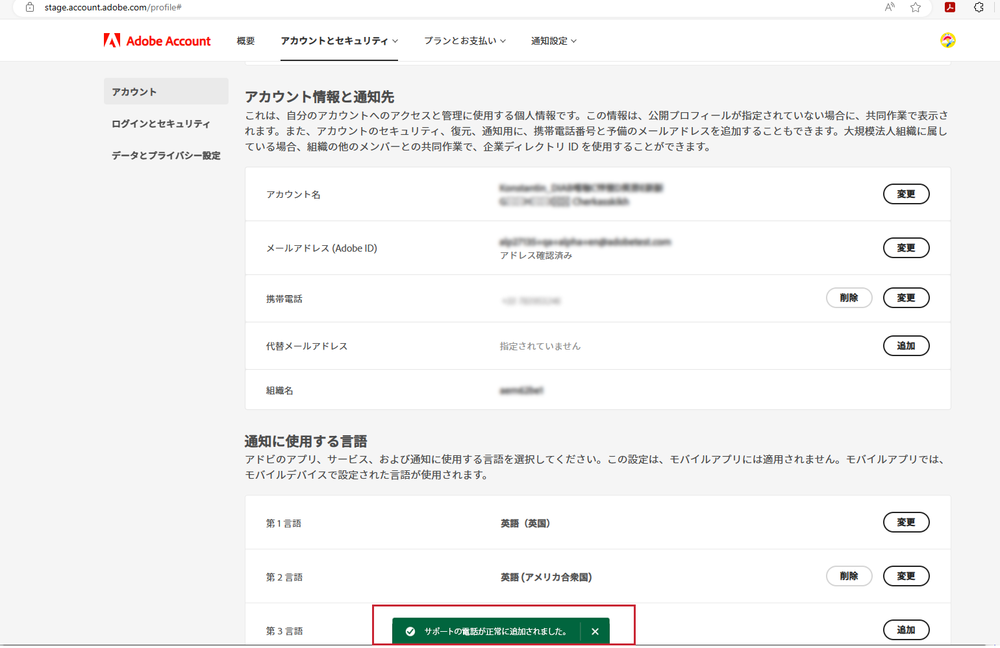

# 希望するサポートの電話番号を指定します

「製品サポート管理者」などの「管理者」の役割が割り当てられると、管理者権限が付与されたインスタンスを管理するための「管理者」権限があることを知らせるメールが届きます。

メールには、アカウントプロファイルにアクセスして希望のサポート電話番号をアドビに共有する方法を説明する、以下のテキストが赤で表示されます。

希望の電話番号を指定するには：

1. **アカウントプロファイル**&#x200B;リンクをクリックして新しいウィンドウを開き、`account.adobe.com` を使用してログインします。

   

1. ログインプロセスを完了し、`account.adobe.com` の以下の画面に移動します。
1. 次に、以下の「アカウントとセキュリティ」タブ／「アカウント」をクリックして、「サポートの電話番号」フィールドを表示します。
1. サポートニーズに合わせて、お客様を認識するために使用する電話番号をここに追加します。

